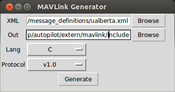
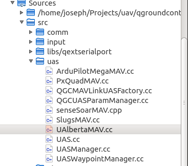
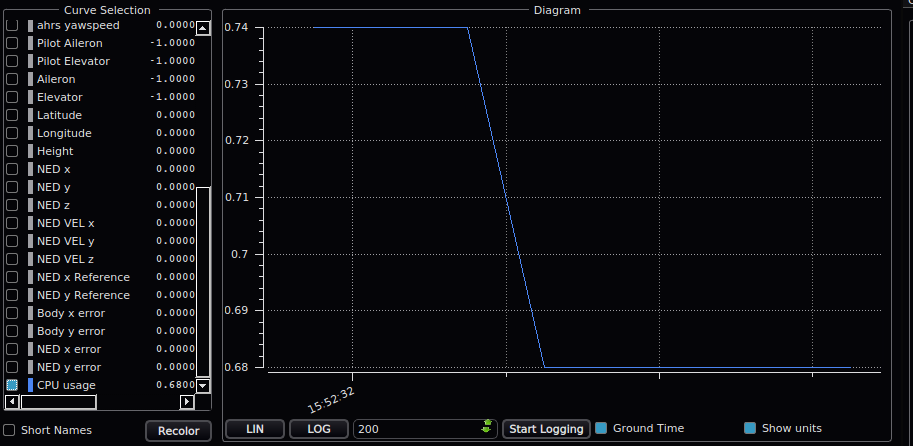

HOWTO Write a UDenver Autopilot Plugin
======================================

The University of Denver autopilot is a highly extensible system, plugins can 
be written and built in to the system in short order meaning that you can add
support for new devices or functionality quickly.

We'll create a plugin used for polling CPU load on the system and reporting it
back to the ground station.

Implementing the Driver
-----------------------

First, make a directory under `src` that will contain the files your plugin 
needs to operate, in this example we'll use `linux` and put in the files `Linux.h`
and `Linux.cc`. **Make sure you end your C++ files with the .cc extension!**

This is our `Linux.h` file:

		/**************************************************************************
		 * Copyright 2014 Joseph Lewis <joseph@josephlewis.net>
		 * 
		 * This file is part of University of Denver Autopilot.
		 * 
		 *     UDenver Autopilot is free software: you can redistribute it 
		 * 	   and/or modify it under the terms of the GNU General Public 
		 *     License as published by the Free Software Foundation, either 
		 *     version 3 of the License, or (at your option) any later version.
		 * 
		 *     UDenver Autopilot is distributed in the hope that it will be useful,
		 *     but WITHOUT ANY WARRANTY; without even the implied warranty of
		 *     MERCHANTABILITY or FITNESS FOR A PARTICULAR PURPOSE.  See the
		 *     GNU General Public License for more details.
		 * 
		 *     You should have received a copy of the GNU General Public License
		 *     along with UDenver Autopilot. If not, see <http://www.gnu.org/licenses/>.
		 *************************************************************************/

		#ifndef LINUX_H
		#define LINUX_H

		#include <atomic>  // Used for atomic types
		#include <mutex>  // Used for singleton design.
		#include "Driver.h"  // All drivers implement this.

		/**
		 * Provides an interface to the performance of Linux.
		 **/
		class Linux: public Driver {
		public:
			/**
			Returns the one allowed instance of this Driver
			**/
			static Linux* getInstance();
	
			/**
			 * Returns the CPU utilization of the whole system.
			 **/
			float getCpuUtilization() const { return cpu_utilization.load();}
	
			// We'll get to this in a bit
			virtual bool sendMavlinkMsg (mavlink_message_t* msg, int uasId, int sendRateHz, int msgNumber) override;

	
		private:
			static Linux* _instance; 
			static std::mutex _instance_lock;

			Linux();
			virtual ~Linux();

			static void cpuInfo(Linux* instance);  // this will be started in a new thread
			std::atomic<float> cpu_utilization;  // store the value here
			bool isEnabled;  // tells us if the plugin is enabled or not
		};

		#endif /* LINUX_H */
		
Section by section we have:

		/**************************************************************************
		 * Copyright 2014 Joseph Lewis <joseph@josephlewis.net>
		 * 
		 * This file is part of University of Denver Autopilot.
		 * 
		 *     UDenver Autopilot is free software: you can redistribute it 
		 * 	   and/or modify it under the terms of the GNU General Public 
		 *     License as published by the Free Software Foundation, either 
		 *     version 3 of the License, or (at your option) any later version.
		 * 
		 *     UDenver Autopilot is distributed in the hope that it will be useful,
		 *     but WITHOUT ANY WARRANTY; without even the implied warranty of
		 *     MERCHANTABILITY or FITNESS FOR A PARTICULAR PURPOSE.  See the
		 *     GNU General Public License for more details.
		 * 
		 *     You should have received a copy of the GNU General Public License
		 *     along with UDenver Autopilot. If not, see <http://www.gnu.org/licenses/>.
		 *************************************************************************/

This is the standard GNU GPL license, it ensures that all code you produce can
be used with the UDenver Autopilot and alerts future developers to who owns the 
intellectual property.

Next up are the macros that ensure the file is only included once, be sure to
name them appropriately for your file:

		#ifndef LINUX_H
		#define LINUX_H

Afterwards we have the includes, C++11 allows for built in [atomic types](http://en.cppreference.com/w/cpp/atomic/atomic) and 
mutexes. We'll use atomics for anything that we want to store that is an int,
float, int, bool, or char that needs to be modified in one thread and accessed
in another. We'll use a mutex for locking the instance of this driver. 
`Driver.h` provides access to a collection of 
methods that provide logging mechanisms, configuration management, quick serial
port configuration, and notification to shut down.

		#include <atomic>  // Used for atomic types
		#include <mutex>  // Used for singleton design.
		#include "Driver.h"  // All drivers implement this.

After we have our class definition:

		class Linux: public Driver {
		public:

We try to make all Drivers [singetons](https://en.wikipedia.org/wiki/Singleton_pattern),
meaning only one can exist at a time in the application, and to get that one
we just call `getInstance()` this makes sure you don't mistakenly create 
multiple instances and then get multiple messages back, and it also means you 
don't have to keep track of the object once the first `getInstance()` is called.

			/**
			Returns the one allowed instance of this Driver
			**/
			static Linux* getInstance();
	
Here we have a method that returns the CPU utilization (what we're measuring).
Note that the method is `const` meaning it doesn't change any internal variables
and it returns `cpu_utilization.load()`, the `.load()` method of a `std::atomic`
returns the value stored in that atomic. Usually it isn't needed, but trying
to return a direct `cpu_utiliztion` would be of type `std::atomic<float>` not 
`float`!

			/**
			 * Returns the CPU utilization of the whole system.
			 **/
			float getCpuUtilization() const { return cpu_utilization.load();}

After that, we have a method that is overridden from `Driver.h`, by default
you do not need to override this method if you are making a driver, just if you
want the driver to report something back to QGroundControl.

This method is called once every time QGroundControl wants to send a message, 
it is passed in a blank `mavlink_message_t`, the Id of the helicopter, 
the number of packets sent to QGroundControl per second and the total number of
messages sent so far. These last two can be used to limit the number of messages
you send to a certain rate.

			virtual bool sendMavlinkMsg (	mavlink_message_t* msg, 
											int uasId, 
											int sendRateHz, 
											int msgNumber) override;

Our private variables are fairly straightforward:

* `_instance` - holds the created instance of this object
* `_instance_lock` - locks the instance so we don't inadvertantly create 
multiple
* `cpu_utilization` - stores the current utilization
* `isEnabled` - stores the configuration value of whether or not this driver
is enabled. We want to store it because looking it up every time is expensive.

		private:
			static Linux* _instance; 
			static std::mutex _instance_lock;
			std::atomic<float> cpu_utilization;  // store the value here
			bool isEnabled;  // tells us if the plugin is enabled or not
			
After those comes the standard constructor and destructor:

			Linux();
			virtual ~Linux();

Finally we have the method that does the fun stuff. It is what is started in a 
new thread to do the reading. We pass a pointer to instance rather
than having it use `getInstance()` inside the `cpuInfo` method because there is
no gaurantee that `getInstance()` will return the actual instance immediately 
when this thread begins, it could instead hang the program!

			static void cpuInfo(Linux* instance);  // this will be started in a new thread

Now let's look at our C++ definition file:

		/**************************************************************************
		 * Copyright 2014 Joseph Lewis <joseph@josephlewis.net>
		 * 
		 * This file is part of University of Denver Autopilot.
		 * 
		 *     UDenver Autopilot is free software: you can redistribute it 
		 * 	   and/or modify it under the terms of the GNU General Public 
		 *     License as published by the Free Software Foundation, either 
		 *     version 3 of the License, or (at your option) any later version.
		 * 
		 *     UDenver Autopilot is distributed in the hope that it will be useful,
		 *     but WITHOUT ANY WARRANTY; without even the implied warranty of
		 *     MERCHANTABILITY or FITNESS FOR A PARTICULAR PURPOSE.  See the
		 *     GNU General Public License for more details.
		 * 
		 *     You should have received a copy of the GNU General Public License
		 *     along with UDenver Autopilot. If not, see <http://www.gnu.org/licenses/>.
		 *************************************************************************/

		#include "Linux.h"
		#include <boost/thread.hpp>
		#include <iostream>
		#include <fstream>

		#include "RateLimiter.h"

		Linux* Linux::_instance = NULL;
		std::mutex Linux::_instance_lock;

		Linux* Linux::getInstance()
		{
			std::lock_guard<std::mutex> lock(_instance_lock);
			if (_instance == NULL)
			{
				_instance = new Linux;
			}
			return _instance;
		}

		Linux::Linux()
		:Driver("Linux CPU Info","linux_cpu_info")
		{	
			isEnabled = configGetb("enabled", true);
	
			// If the system wants to halt, don't start running.
			if(terminateRequested())
			{
				return;
			}

			// If the user has disabled this component, don't start running
			if(! isEnabled)
			{
				return;
			}

			// Tell the user we made it up
			warning() << "starting CPU Information System";
	
			// Start our processing thread.
			boost::thread(std::bind(Linux::cpuInfo, this));
		}

		Linux::~Linux() {

		}

		void Linux::cpuInfo(Linux* instance)
		{	
			RateLimiter rl(1);

			std::ifstream myfile;
			myfile.open ("/proc/loadavg");
	
			float util = 0;
			while(!instance->terminateRequested())
			{
				rl.wait(); // suspends until we're ready to go
		
				myfile >> util;
				myfile.seekg(0); // go to the beginning of the file
				instance->cpu_utilization = util; // set our utilization
				instance->debug() << "Got Load of: " << util;
		
				rl.finishedCriticalSection(); // call to yield
			}
	
			myfile.close();
		}

		bool Linux::sendMavlinkMsg(mavlink_message_t* msg, int uasId, int sendRateHz, int msgNumber)
		{
			if(! isEnabled) return false;

			if(msgNumber % sendRateHz == 0) // do this once a second.
			{
				debug() << "Sending CPU Utilization";
				mavlink_msg_udenver_cpu_usage_pack(uasId, 40, msg, getCpuUtilization());
				return true;
			}
			return false;
		};
		
Again, let's go section by section ignoring the includes and copyright this 
time. First, we must set defaults for the mutex and instance, this ensures
that `getInstance()` will work as anticipated:

		Linux* Linux::_instance = NULL;
		std::mutex Linux::_instance_lock;

Next, we write the `getInstance()` method, the first time it is called the lock
gets locked, `_instance` is `NULL` and we create a new object then return it.
Each time after we see `_instance` is no longer `NULL` and we return the
instance.

		Linux* Linux::getInstance()
		{
			std::lock_guard<std::mutex> lock(_instance_lock);
			if (_instance == NULL)
			{
				_instance = new Linux;
			}
			return _instance;
		}

The constructor comes after, we must instantiate `Driver` with two things:

1. A human readable name for this `Driver` used in logging
2. A [valid XML tag name](https://en.wikipedia.org/wiki/XML#Well-formedness_and_error-handling)
used for storing this `Driver`'s configuration.

Immediately after staring we set our variables, and check if `terminateRequested`
is `true`, this is a method provided by `Driver` that alerts all components of
the system that the Helicopter wants to quit. Once they check it they should 
prepare themselves for termination by saving all needed data and then exiting.

After that we quit if the user had explicitly disabled this component in `config.xml`.

Finally we emit a message telling the user that we are going to start up, and
call the `cpuInfo` method in a new thread passing it `this` as the instance
param.

		Linux::Linux()
		:Driver("Linux CPU Info","linux_cpu_info")
		{	
			isEnabled = configGetb("enabled", true);
	
			// If the system wants to halt, don't start running.
			if(terminateRequested())
			{
				return;
			}

			// If the user has disabled this component, don't start running
			if(! isEnabled)
			{
				return;
			}

			// Tell the user we made it up
			warning() << "starting CPU Information System";
	
			// Start our processing thread.
			boost::thread(std::bind(Linux::cpuInfo, this));
		}

Our destructor is empty for now because the object is never destroyed.

		Linux::~Linux() {

		}

The `cpuInfo` method is fairly simple. Most of the time Drivers are interacting
with a serial port and wait when the read and write to that, however `Linux` 
reads from the local machine, therefore we must rate limit it to a reasonable
speed, in this case 1Hz. This limiting keeps it from doing this thousands of 
times a second and maxing out the CPU.

After we create our `RateLimiter` we open the file, specified by the [proc man page](http://man7.org/linux/man-pages/man5/proc.5.html)
this file is a special one provided by the Linux kernel, it is updated every 
five seconds with information about the CPU usage of the machine.

Once the file is open, we loop until the autopilot wants to shut down updating
as we go along, and finally close the file.

		void Linux::cpuInfo(Linux* instance)
		{	
			RateLimiter rl(1);

			std::ifstream myfile;
			myfile.open ("/proc/loadavg");
	
			float util = 0;
			while(!instance->terminateRequested())
			{
				rl.wait(); // suspends until we're ready to go
		
				myfile >> util;
				myfile.seekg(0); // go to the beginning of the file
				instance->cpu_utilization = util; // set our utilization
				instance->debug() << "Got Load of: " << util;
		
				rl.finishedCriticalSection(); // call to yield
			}
	
			myfile.close();
		}

The last method is fairly straightfoward. When QGroundControl wants to emit
more messages, it calls this on every `Driver`. If `Linux` is not enabled, then
we return `false` meaning we don't have a message to send, otherwise we'll try
to send once a second (the message number modulo the send rate). 

At that time, we'll send a debug message, pack the message using a method 
automatically provided by Mavlink once we tell it about our message, and 
return `true`. `QGCLink` will handle the rest and your message will begin to be
parsed by QGroundControl on the other side.

		bool Linux::sendMavlinkMsg(mavlink_message_t* msg, int uasId, int sendRateHz, int msgNumber)
		{
			if(! isEnabled) return false;

			if(msgNumber % sendRateHz == 0) // do this once a second.
			{
				debug() << "Sending CPU Utilization";
				mavlink_msg_udenver_cpu_usage_pack(uasId, 40, msg, getCpuUtilization());
				return true;
			}
			return false;
		};

Integrating With the Autopilot
------------------------------

Once we have this simple skeleton of a plugin, we can add initializing it to the
`MainApp` class which is responsible for starting all extensions. At the top, 
include `Linux.h` and in the `MainApp::run()` method, call getInstance() after
all the other plugins have done the same:

		...
		message() << "Setting up altimeter";
		MdlAltimeter::getInstance();
		
		message() << "Setting up Linux CPU Reader";
		Linux::getInstance();
		...

It is polite to leave a message before your `getInstance()` in the event your
plugin hangs the system the user will be able to tell where it happened.
		
The RateLimiter class suspends a thread until it is time to wake up and do work,
calling the finishedCriticalSection() allows the thread to give up control of 
its remaining time. This ensures the process runs smoothly and is kind to all
other threads on the system.

Sending Data to QGroundControl
------------------------------

Data is ferried between QGroundControl and the autopilot using MavLink packets.

MavLink auto-generates itself from the `ualberta.xml` file found in 
`extern/mavlink/message_definitions`:

Add the following under the messages section, ensuring the ID used is unique and
less than 255:

		<message id="230" name="UDENVER_CPU_USAGE">
		   <description>Autopilot System CPU Usage</description>
		   <field type="float" name="cpu_usage"/>
		</message>

Then generate the new ualberta xml using the included python `mavgenerate.py` 
script in to `extern/mavlink/include` 

This generates new headers in the `extern/mavlink/include` directory.
Also copy `extern/mavlink` to the same directory as QGroundControl so it gets 
the updated messages as well.

Integrating with QGroundControl
-------------------------------

Be sure to copy the `mavlink` directory to the same parent folder as QGroundControl first.

1. Open `QTCreator`
2. Open the `QGroundControl` project
3. Open the `UAlbertaMav.cc` file under Sources > Src > uas 

4. Scroll to the end of the large `switch` block that begins on line 40.
5. Before the `default` add in the switch for your new message:

        case MAVLINK_MSG_ID_UDENVER_CPU_USAGE:
        {
        	// saves the CPU usage from mavlink
            mavlink_udenver_cpu_usage_t cpu;
            
            // converts the generic message we got to the CPU one we understand
            mavlink_msg_udenver_cpu_usage_decode(&message, &cpu);
            
            // emit a "CPU usage" event, which allows us to graph the usage
            // we use the current UNIX time as the timestamp, although you may
            // want to get this from the system instead, left as an exercise
            // for the reader.
            emit valueChanged(uasId, "CPU usage", "amt", cpu.cpu_usage, getUnixTime());
            break;
        }

6. Save, compile, and run QGroundControl

Running
-------

Now we can build the autopilot and your plugin will be added in! If it is not,
make sure your C++ file has the .cc extension.

Now run the autopilot, if you don't see your extension starting, check to make
sure that your `<enabled>` tag in the config.xml file is `true`. You should see
a message like this when your extension begins:

		Debug:    Linux CPU Info: starting CPU Information System

In `config.xml` you should see a definiton like this:

        <linux_cpu_info>
                <debug>false</debug>
                <read_style>2</read_style>
                <read_style_COMMENT>0:read until min, 1:readcond, 2:re$
                <enabled>false</enabled>
        </linux_cpu_info>

Let's set `debug` to true and `enabled` to true as well, ignoring the 
`read_style` for now. When `debug` is true, it allows the printing of 
debugging messages from the module and also turns all `trace` messages into 
logged messages.

Now you can plot the CPU utilization from within QGroundControl! 
